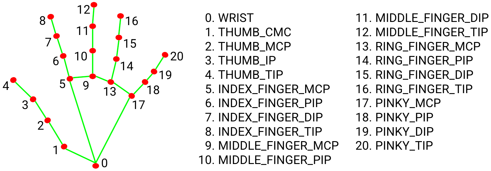
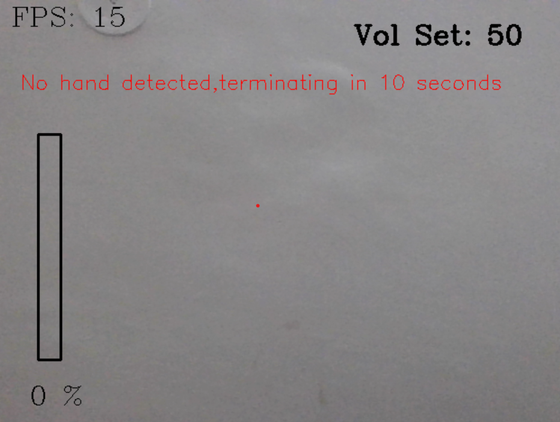

HAND GESTURE VOLUME CONTROL

Project Summary:

The Hand Gesture Volume Controller project aims to provide a method for
controlling a PC’s volume using hand gestures. This project utilizes computer
vision technology and Mediapipe (an open source by Google) to recognize
and interpret specific hand movements and translate them into volume
adjustments for audio playback.

Project Objectives:

● Develop a real-time hand recognition and detection system.
● Enable users to control volume levels through different hand gestures.
● Ensure robustness and accuracy in the project for a reliable user
experience.

Requirements:
● opencv-python
● mediapipe
● comtypes
● numpy
● pycaw

1. openCV: openCV stands for Open Source Computer Vision Library. It is
a cross-platform library that includes hundreds of computer vision
algorithms. It is used in image processing, video processing, object detection,
face recognition, motion tracking, augmented reality etc.

2. Mediapipe: MediaPipe is an open-source framework for building
pipelines to perform computer vision inference over arbitrary sensory data
such as video or audio.
These libraries and resources provide the core functionality for each
MediaPipe Solution:
● MediaPipe Tasks: Cross-platform APIs and libraries for deploying
solutions.
● MediaPipe Models: Pre-trained, ready-to-run models for use with each
solution.
In this project, the Hand Landmarks Detection Model of Mediapipe is used.

3. Comtypes: It is a lightweight Python COM package, based on the ctypes
FFI library. Comtypes allows us to define, call, and implement custom and
dispatch-based COM interfaces in pure Python. This package works on
Windows only.

4. Numpy: Numpy contains a multi-dimensional array and matrix data
structures. It can be utilized to perform many mathematical operations on
arrays.

5. Pycaw: Python Core Audio Windows Library, working for both Python2
and Python3.It was created by Andre Miras.
The Git repository link for pycaw is given below:
https://github.com/AndreMiras/pycaw.git

Output:

Setting the volume:

Terminating if no hand detected for 10 seconds:

